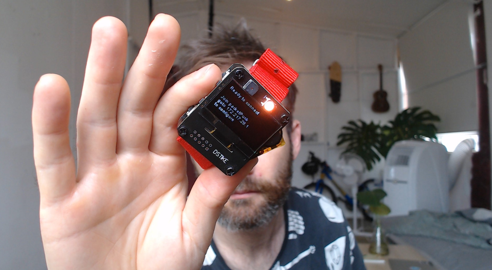

# packetPunk 📦🧷

**packetPunk** is an Arduino sketch for the **DSTIKE ESP32 watch devkit**, an ESP32 microcontroller with an OLED display, a NeoPixel, flashlight, buzzer, battery, charging circuit, SD card slot, and a few buttons.

The application listens to incoming OSC messages on port 9000 and writes these messages to SD card with timestamps for easy playback.  It has a limited but friendly onscreen UI and status is communicated via the onboard RGB LED.

I use it with the supberb iOS application [gyrosc](https://www.bitshapesoftware.com/instruments/gyrosc/) but it should work with any application capable of sending OSC.

### Usage
- Follow onscreen instructions to connect to network (password is packetPunk)
- OSC messages are received on port 9000.
- Press the top left button to start logging, press again to save file.
- Long-press  bottom left button to disconnect from current WiFi network.
- If you need to manage saved networks use [this sketch](https://github.com/Hieromon/AutoConnect/blob/master/examples/Credential/Credential.ino).

Example log playback patches for Max and Pure Data included.

### Required libraries
- OSC https://github.com/CNMAT/OSC
- Autoconnect https://github.com/hieromon/AutoConnect
- OLED manager https://github.com/ThingPulse/esp8266-oled-ssd1306
- NeoPixel https://github.com/adafruit/Adafruit_NeoPixel
- AceButton https://github.com/bxparks/AceButton

🔺🔷🔻🔷🔺🔷🔻🔷🔺🔷🔻🔷🔺🔷🔻🔷🔺

### todo / wishlist
- Better dynamic WiFi management (update state if knocked off network).
- Menu to allow editing port and other settings
- Efficient dynamic display with battery level and recording time.
- Playback!!
